# SSH Access Control Lab

This lab demonstrates how to configure the SSH server in Linux, allow access only to a specific user, and test the configuration.

## 📋 Lab Objectives

- Check SSH service status
- View SSH logs with `journalctl`
- Backup and edit the `sshd_config` file
- Restrict access using `AllowUsers`
- Restart SSH service and test access for allowed and denied users

---

## 🧪 Lab Steps & Screenshots

| Step | Description | Screenshot |
|------|-------------|------------|
| 1 | Check SSH service status | 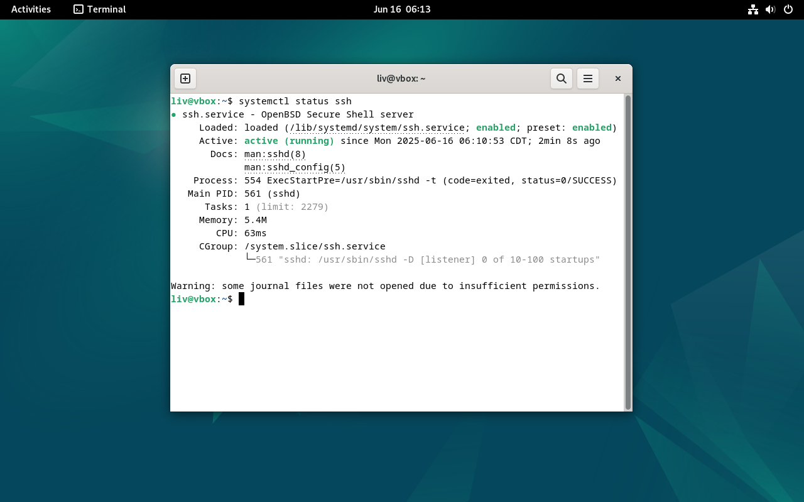 |
| 2 | Restart the SSH service | 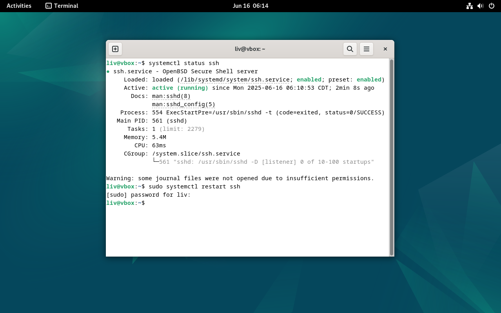 |
| 3 | View SSH-related logs | 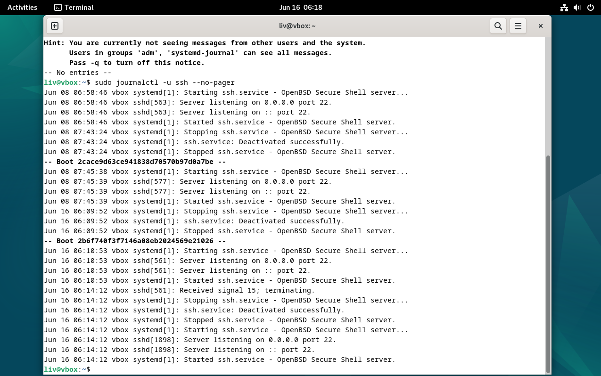 |
| 4 | Backup `sshd_config` | 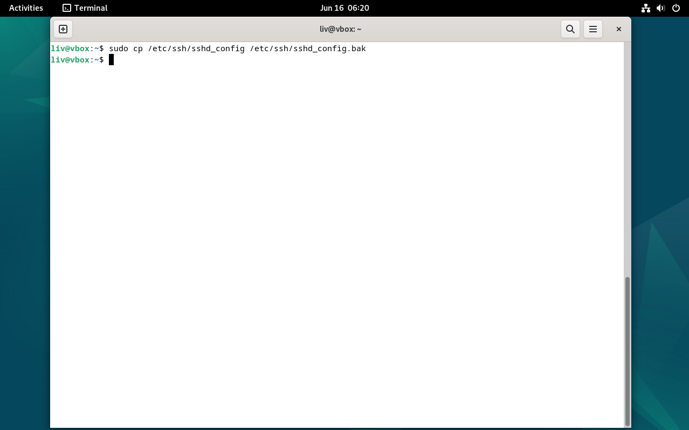 |
| 5 | Open `sshd_config` in nano | 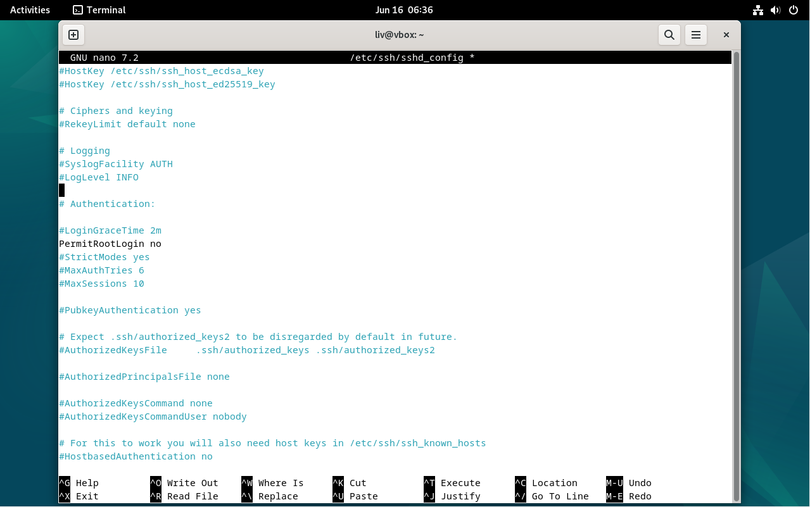 |
| 6 | Confirm password authentication enabled | 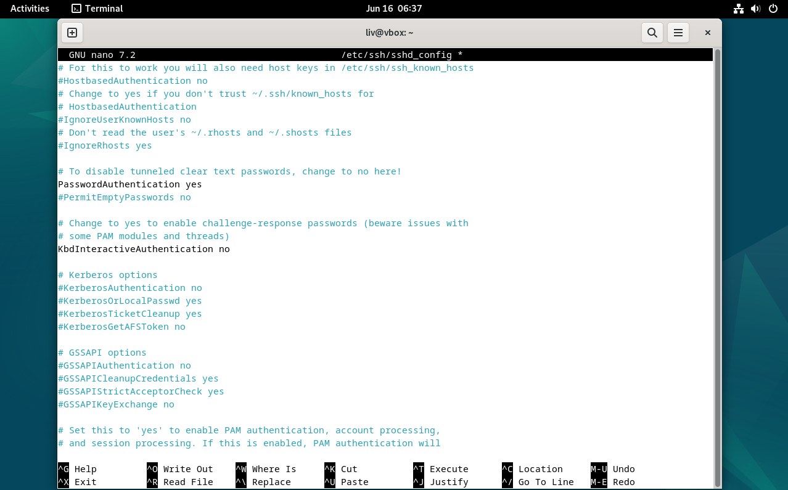 |
| 7 | Add `AllowUsers liv` directive | 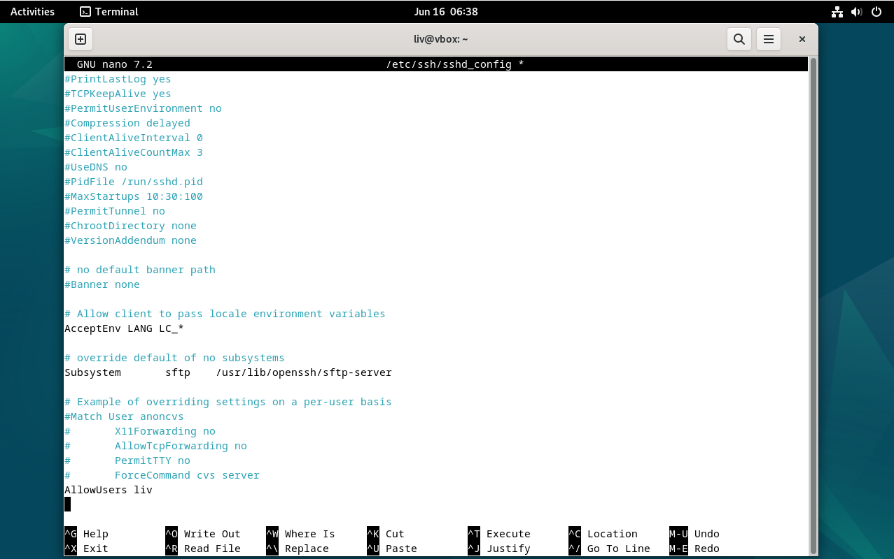 |
| 8 | Restart SSH service after config edit | 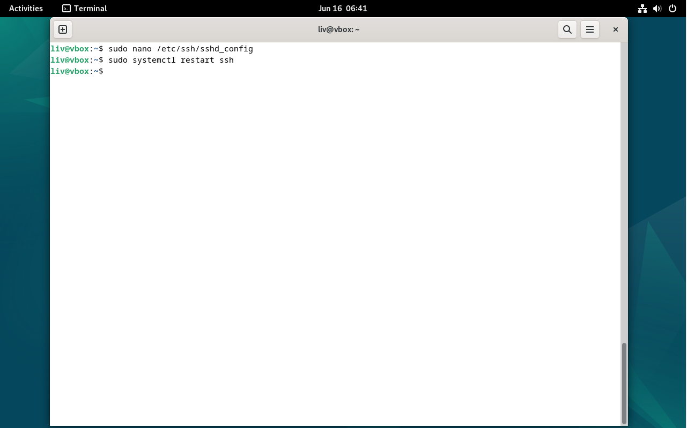 |
| 9 | Log in via SSH as `liv` (success) | 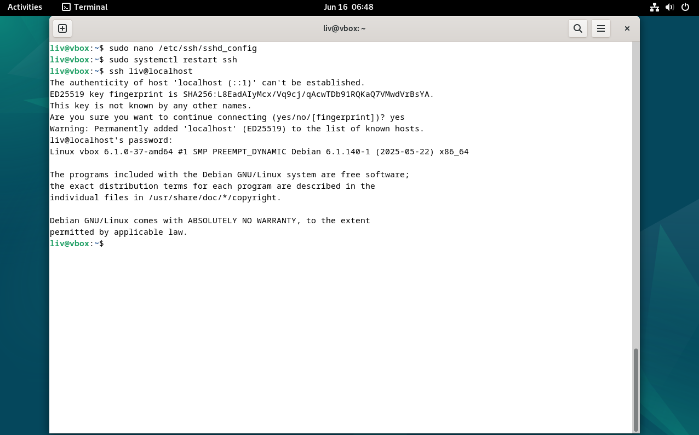 |
| 10 | Attempt SSH login as other user (denied) | 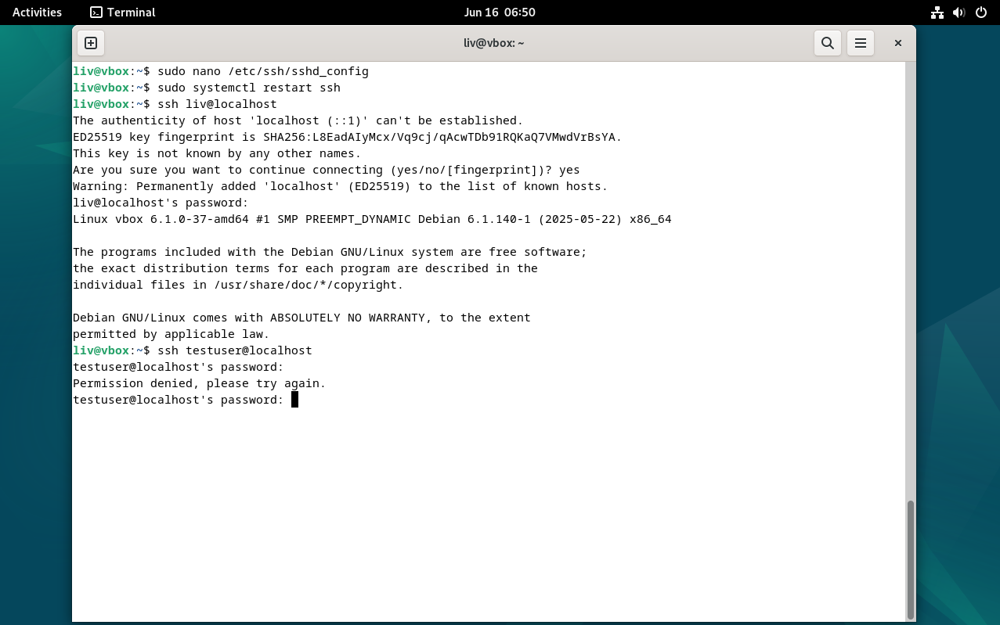 |
| 11 | Final SSH login verification | 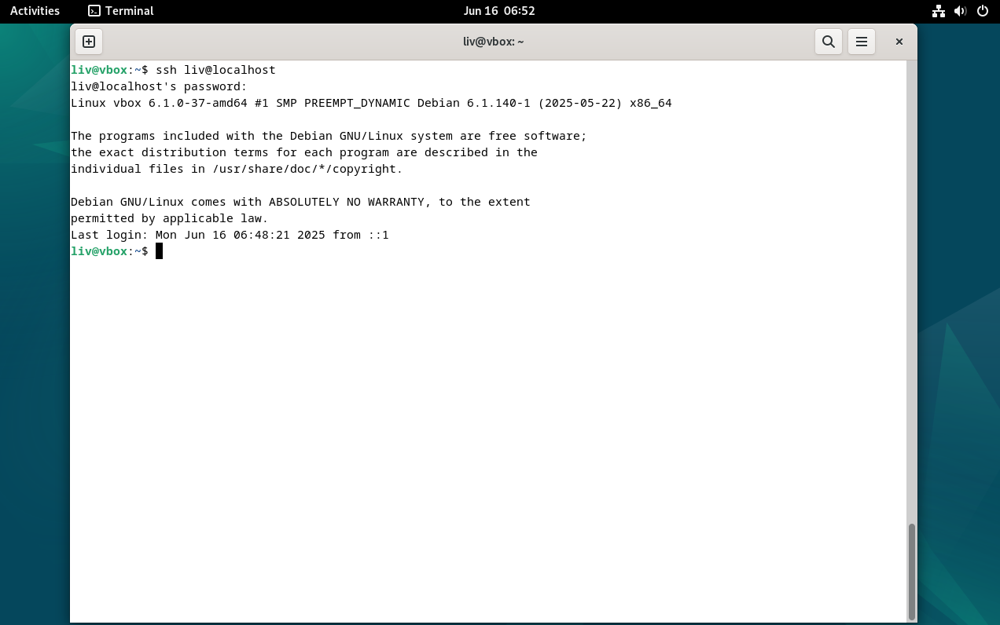 |

---

## ✅ Result

Access is successfully restricted to the `liv` user via SSH. Other users are denied, as expected.

---

## 💬 Notes

- OS: Debian-based (VirtualBox)
- Commands used: `systemctl`, `journalctl`, `nano`, `ssh`, `cp`, `sudo`
- Backup file created: `/etc/ssh/sshd_config.bak`

